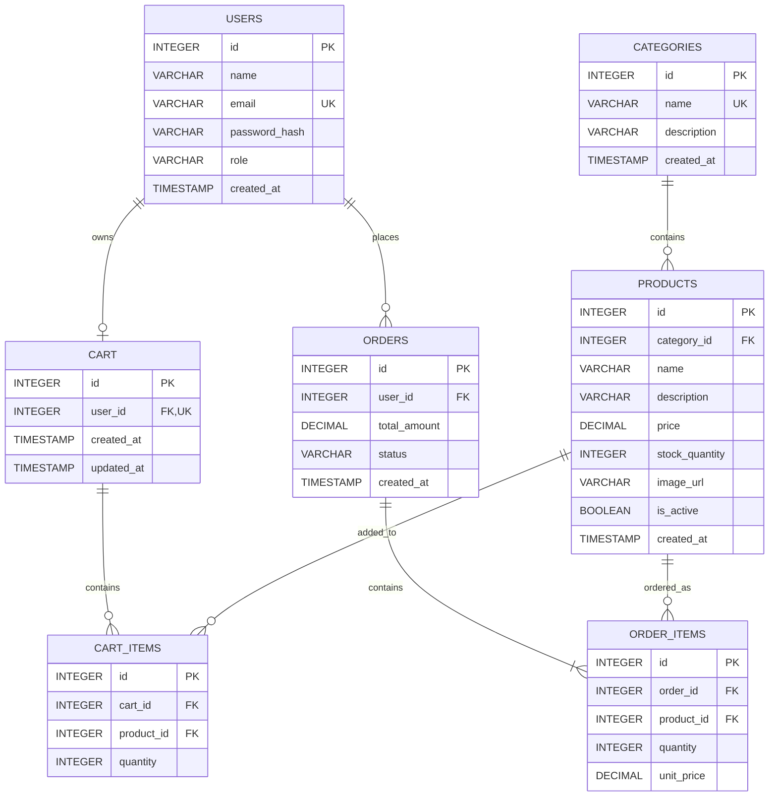

# AutoEase — Sprint 1: System Architecture & Scope

## 1. Target Audience & Market Focus

### Primary Persona

AutoEase primarily targets car owners in Pakistan who are looking for affordable, practical, and useful car accessories for their daily driving needs. The target customers include university students, young professionals, office workers, and other individual car owners who prefer purchasing automotive accessories online.

The typical customer is comfortable using online shopping platforms but may find it difficult to identify reliable and suitable car accessories from different sellers. AutoEase aims to provide a simple and convenient platform where customers can browse products, compare options, and place orders online.

### Core Pain Point

Car owners often have difficulty finding practical car accessories from a reliable and organized online store. Products may be scattered across different marketplaces and social media sellers, making it difficult to find suitable products, understand product details, and make a confident purchasing decision.

AutoEase addresses this problem by providing a focused e-commerce platform where customers can easily discover, browse, and purchase useful car accessories in one place.

### Domain Scope

AutoEase operates within the **Car & Automotive Accessories E-Commerce** domain in Pakistan.

The platform focuses on everyday automotive accessories such as car organizers, mobile holders, cleaning and care products, safety accessories, charging accessories, and other practical car-related products. The initial system will focus on product browsing, searching, cart management, checkout, and order processing within this domain.

---

## 2. Minimum Viable Product (MVP) Feature Scope

The MVP is intentionally limited to five core workflows so that it remains feasible within the academic semester.

| Category | Feature Name | Description | Priority |
|---|---|---|---|
| Authentication | User Registration & Authentication | Customer registration, login, password hashing, and JWT-based authentication. | High (MVP) |
| Catalog | Product List & Search | Product browsing with category-based organization and basic search/filtering. | High (MVP) |
| Cart | Cart Management | Persistent cart allowing users to add, modify quantities, and remove products. | High (MVP) |
| Checkout | Order Processing | Checkout flow that validates cart contents and creates an order; payment can initially use a mock gateway. | High (MVP) |
| Admin | Inventory Control | Admin CRUD operations for products, categories, prices, and stock quantities. | Medium |

**MVP boundary:** Advanced recommendations, reviews/ratings, coupons, wishlists, live payment settlement, delivery-provider integration, real-time tracking, and advanced analytics are outside Sprint 1/MVP scope.

---

## 3. Tech Stack Selection & Justification

### Frontend Framework: React.js

React.js is selected because its component-based architecture is well suited to reusable e-commerce interfaces such as product cards, category navigation, carts, and checkout screens. Compared with building the interface with plain JavaScript, React provides a more maintainable structure for a multi-page academic project.

### Backend Infrastructure: Node.js + Express.js

Node.js with Express.js provides a lightweight API-oriented backend that fits the project's CRUD-heavy e-commerce workflows. Its JavaScript ecosystem also allows the team to use a consistent language across frontend and backend, while Express keeps the server architecture relatively simple compared with heavier frameworks.

### Database Management System: PostgreSQL

PostgreSQL is selected because AutoEase has strongly relational data: users place orders, orders contain order items, products belong to categories, and carts contain cart items. A relational database provides foreign-key constraints, transactional consistency, and clear normalization, making it more appropriate here than a document-oriented database such as MongoDB.

### Caching & Asynchronous Processing (Optional): Redis

Redis is optional for the initial MVP. It can later be used for session-related caching, frequently accessed catalog data, rate limiting, or temporary checkout data, but it is not required for the core semester implementation.

---

## 4. Entity-Relationship Diagram (ERD)

### 4.1 Entities and Attributes

#### USERS
- `id` — INTEGER, PK
- `name` — VARCHAR(100), NOT NULL
- `email` — VARCHAR(255), UNIQUE, NOT NULL
- `password_hash` — VARCHAR(255), NOT NULL
- `role` — VARCHAR(20), NOT NULL, default `customer`
- `created_at` — TIMESTAMP, NOT NULL

#### CATEGORIES
- `id` — INTEGER, PK
- `name` — VARCHAR(100), UNIQUE, NOT NULL
- `description` — VARCHAR(500)
- `created_at` — TIMESTAMP, NOT NULL

#### PRODUCTS
- `id` — INTEGER, PK
- `category_id` — INTEGER, FK → CATEGORIES.id, NOT NULL
- `name` — VARCHAR(150), NOT NULL
- `description` — VARCHAR(1000)
- `price` — DECIMAL(10,2), NOT NULL
- `stock_quantity` — INTEGER, NOT NULL
- `image_url` — VARCHAR(500)
- `is_active` — BOOLEAN, NOT NULL, default TRUE
- `created_at` — TIMESTAMP, NOT NULL

#### CART
- `id` — INTEGER, PK
- `user_id` — INTEGER, FK → USERS.id, UNIQUE, NOT NULL
- `created_at` — TIMESTAMP, NOT NULL
- `updated_at` — TIMESTAMP, NOT NULL

#### CART_ITEMS
- `id` — INTEGER, PK
- `cart_id` — INTEGER, FK → CART.id, NOT NULL
- `product_id` — INTEGER, FK → PRODUCTS.id, NOT NULL
- `quantity` — INTEGER, NOT NULL

Recommended constraint: `UNIQUE(cart_id, product_id)` so the same product is represented by one cart-item row.

#### ORDERS
- `id` — INTEGER, PK
- `user_id` — INTEGER, FK → USERS.id, NOT NULL
- `total_amount` — DECIMAL(10,2), NOT NULL
- `status` — VARCHAR(30), NOT NULL
- `created_at` — TIMESTAMP, NOT NULL

#### ORDER_ITEMS
- `id` — INTEGER, PK
- `order_id` — INTEGER, FK → ORDERS.id, NOT NULL
- `product_id` — INTEGER, FK → PRODUCTS.id, NOT NULL
- `quantity` — INTEGER, NOT NULL
- `unit_price` — DECIMAL(10,2), NOT NULL

`unit_price` is stored in the order item so that the historical purchase price remains available even if the product's current price changes later.

### 4.2 Relationships & Cardinality

- **USERS 1 : N ORDERS** — one user can place many orders; each order belongs to one user.
- **USERS 1 : 1 CART** — one customer has one active cart; each cart belongs to one user.
- **CART 1 : N CART_ITEMS** — one cart can contain many cart items.
- **PRODUCTS 1 : N CART_ITEMS** — one product can appear in many users' carts.
- **ORDERS 1 : N ORDER_ITEMS** — one order contains one or more order items.
- **PRODUCTS 1 : N ORDER_ITEMS** — one product can appear in many order items across different orders.
- **CATEGORIES 1 : N PRODUCTS** — one category contains many products; each product belongs to one category.

Therefore, `ORDERS ↔ PRODUCTS` is logically **N : M**, resolved by the associative entity `ORDER_ITEMS`. Likewise, `CART ↔ PRODUCTS` is **N : M**, resolved by `CART_ITEMS`.

### 4.3 Mermaid ERD

---

## Sprint 1 Decision Summary

**Store:** AutoEase  
**Domain:** Car & Automotive Accessories E-Commerce  
**Target:** Individual car owners in Pakistan  
**MVP:** Authentication, Catalog/Search, Cart, Checkout/Order Processing, Admin Inventory  
**Frontend:** React.js  
**Backend:** Node.js + Express.js  
**Database:** PostgreSQL  
**Optional:** Redis  
**Core Entities:** Users, Categories, Products, Cart, Cart_Items, Orders, Order_Items
